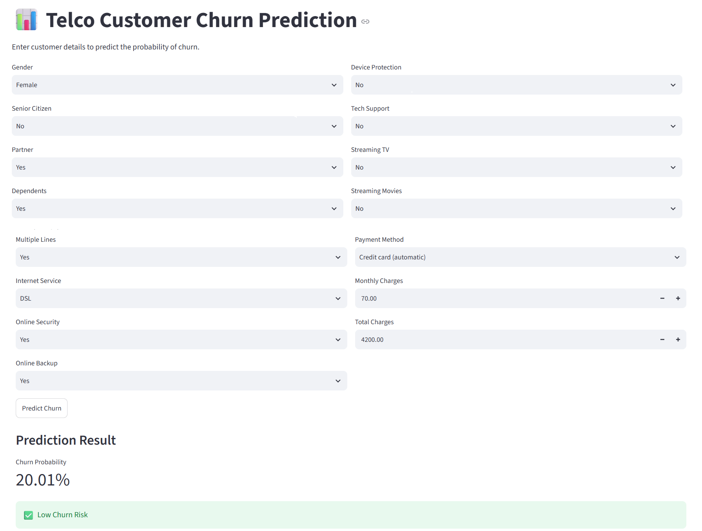
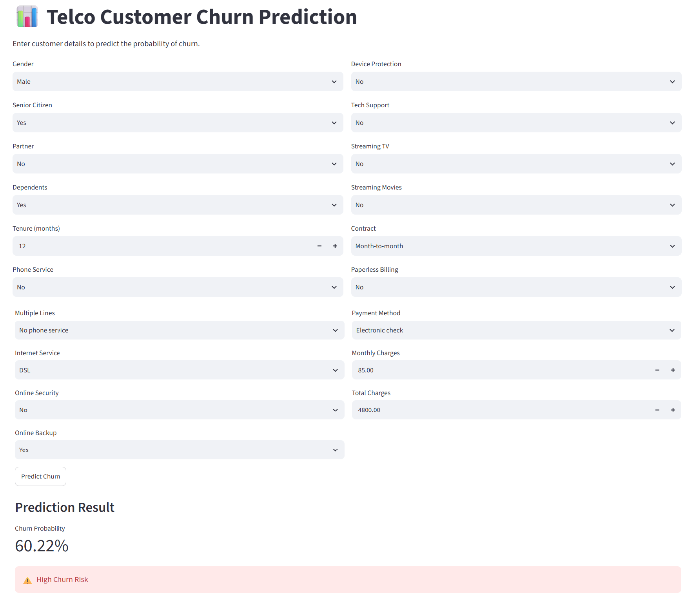

# Customer Churn Prediction
## Project Overview
This project focuses on analyzing customer churn in the telecommunications industry using **SQL Server, Python, Machine Learning, MLflow, Power BI and Streamlit**.

The objective is to understand customer churn patterns, identify important factors associated with churn, build and compare machine learning models, track experiments using MLflow, and create a dashboard for analyzing churn predictions.

## Dataset Source
The project uses the Telco Customer Churn dataset, which contains customer information and churn-related details from a telecommunications company.
The dataset contains customer information such as gender, partner and dependent status, account information, subscribed services, billing details, and customer churn status.

Dataset: Telco Customer Churn
Rows: 7,043
Columns: 21
Target variable: Churn
Source: Internship Project Details Page 

## Project Workflow

**SQL Server → Python & EDA → Data Preprocessing → Machine Learning → MLflow → Churn Predictions → Power BI**
The project follows the workflow shown below.

## How to Run the Project

### 1. SQL Server

* Install **SQL Server Express** and **SQL Server Management Studio (SSMS)**.
* Create the `ChurnDB` database.
* Import the Telco Customer Churn dataset into SQL Server.
* Create the required SQL tables and views.
* The project uses the SQL view `vw_ChurnData` to provide data for the Python analysis.

### 3. Power BI

* Open the Power BI report `Churn Prediction Power BI.pbix`.
* Connect the report to the generated churn prediction data.
* Refresh the data to load the latest predictions.
* Use the dashboard to analyze churn patterns, customer segments, and high-risk customers.

### 2. Python / Jupyter Notebook

* Connect Python to SQL Server using `pyodbc`.
* Load data from the `vw_ChurnData` SQL view into Pandas.
* Perform data cleaning, missing-value handling, EDA, and feature engineering.
* Train and evaluate machine learning models and handle class imbalance using SMOTE.
* Track experiments using MLflow and generate churn predictions.
* Save the trained pipeline as `churn_prediction_pipeline.pkl`.

## Model Results

Three machine learning models were evaluated: Logistic Regression, Random Forest, and XGBoost.

The tuned XGBoost model was selected as the final model because it achieved the highest **churn recall of 83.96%**, which is important for identifying customers who are likely to churn.

| Metric    | XGBoost |
| --------- | ------: |
| Accuracy  |  67.78% |
| Precision |  44.35% |
| Recall    |  83.96% |
| F1-Score  |  58.04% |

## Testing & Debugging
* Verified all required Python dependencies and resolved missing package issues.
* Restarted the Jupyter kernel and successfully executed the complete notebook from top to bottom.
* Resolved a missing-value issue encountered during model training.
* Tested the Power BI refresh and resolved a `Contract` column transformation issue in Power Query.
* Verified that the Power BI dashboard refreshed successfully and the `Contract` visual displayed Month-to-month, One year, and Two year categories.

## Tools & Technologies
* SQL Server
* SQL
* Python
* Pandas
* NumPy
* Scikit-learn
* XGBoost
* MLflow
* Power BI
* Jupyter Notebook
* 
## Streamlit Churn Prediction App
An interactive Streamlit application was developed to predict customer churn probability using the trained XGBoost model.

Users can enter customer details and receive a churn probability with a **High Churn Risk** or **Low Churn Risk** classification.

### Streamlit App

## Docker Deployment
The Streamlit churn prediction app was containerized using Docker for a portable deployment.

### Build the Docker Image
docker build -t telco-churn-app .

### Run the Docker Container
docker run -p 8501:8501 telco-churn-app

Then open `http://localhost:8501` in a browser to access the Streamlit application.

## Key Insights
* Month-to-month contract customers show higher churn.
* Customers using electronic check show higher churn.
* Customers without technical support show higher churn.
* One-year and two-year contract customers show lower churn.

## Recommendations
* Offer contract upgrade incentives to high-risk month-to-month customers.
* Provide technical support or service bundles to eligible high-risk customers.
* Encourage automatic payment enrollment for high-risk customers using electronic checks.
* Use personalized retention outreach for other high-risk customers.

